# FeedMap AI

## Overview

FeedMap AI is an AI-powered food redistribution platform designed to reduce food wastage by connecting food donors, NGOs, delivery partners, and administrators through a centralized intelligent system.

The platform uses AI-based food prioritization and NGO recommendation to ensure that food reaches the right beneficiaries before expiry.

---

## Features

### Authentication & Security

* JWT Authentication
* Secure Login & Signup
* Role-Based Access Control

### User Roles

#### Donor

* Add food donations
* Upload food images
* View donation status
* Track donation progress

#### NGO

* View available food donations
* Search and filter donations
* Accept or reject donations
* View recommended donations

#### Delivery Partner

* View assigned deliveries
* Track delivery progress
* Update delivery status

#### Admin

* Monitor all donations
* Assign delivery partners
* View analytics dashboard
* Manage users and workflows

---

## AI Features

### Food Priority AI

Calculates donation priority using:

* Expiry Time
* Food Quantity
* Food Type
* Urgency Level

### Smart NGO Matching

Recommends the most suitable NGO based on:

* Distance
* NGO Capacity
* Food Category
* Urgency Score

---

## Additional Features

* Interactive Map View
* Delivery Tracking System
* Notifications
* Analytics Dashboard
* Search & Filtering
* Expiry Color System
* Image Upload System

---

## Tech Stack

### Frontend

* React.js
* Vite
* Tailwind CSS
* Axios
* React Router
* Leaflet Maps
* Recharts

### Backend

* Node.js
* Express.js
* MongoDB Atlas
* JWT Authentication
* Multer

---

## Project Architecture

Donor → NGO → Delivery Partner → Beneficiaries

Food donations are prioritized using AI and matched with the most suitable NGO before delivery.

---

## Future Scope

* Route Optimization
* Real-Time Tracking
* Mobile Application
* Predictive Food Demand Analysis
* NGO Performance Analytics

---

## Developed By

Nikhil VS

Major Project – FeedMap AI

## Screenshots

### Login Page

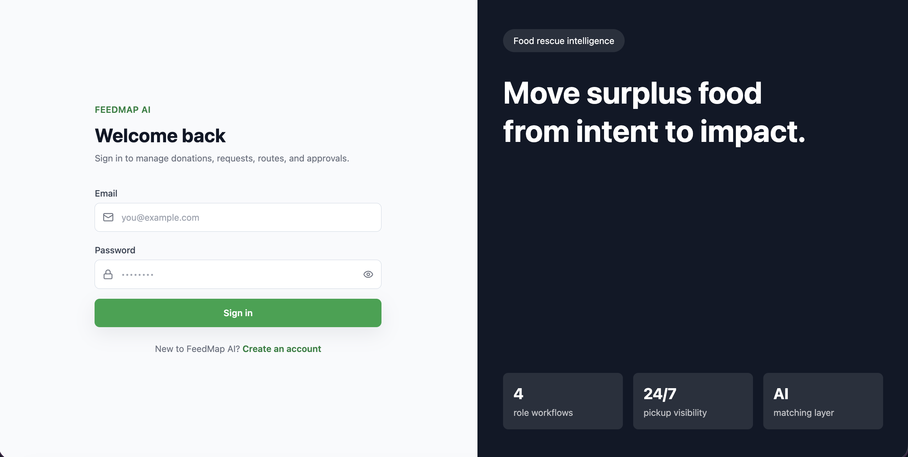

### Donor Dashboard

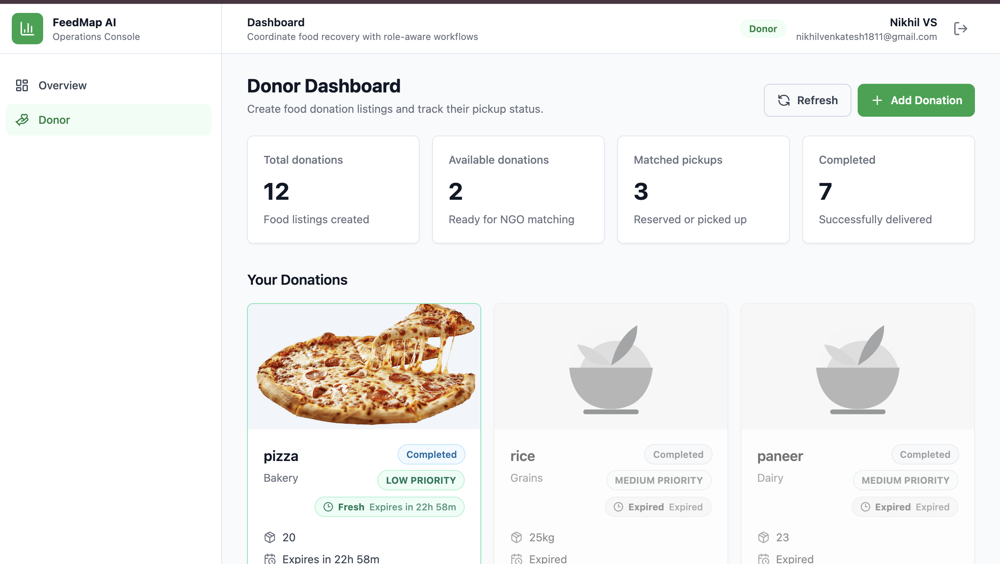
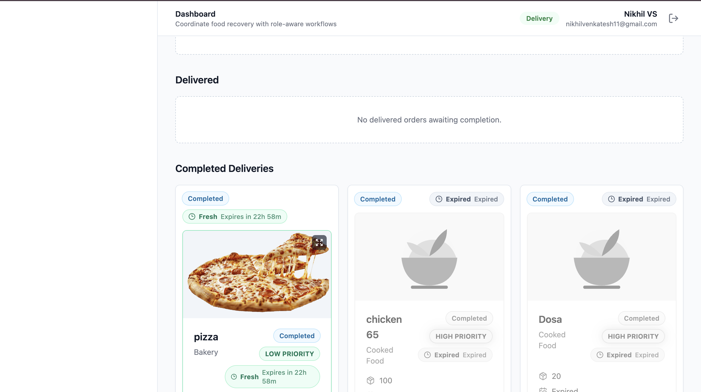
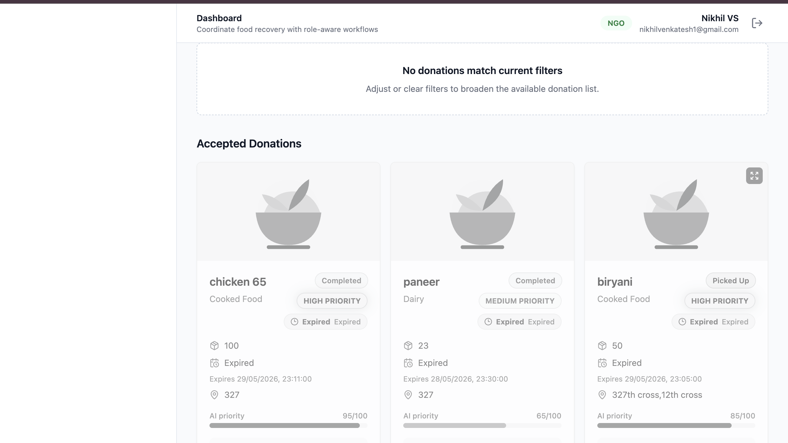

### NGO Dashboard

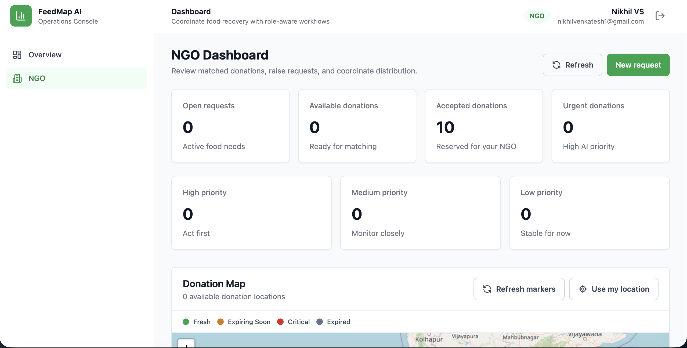
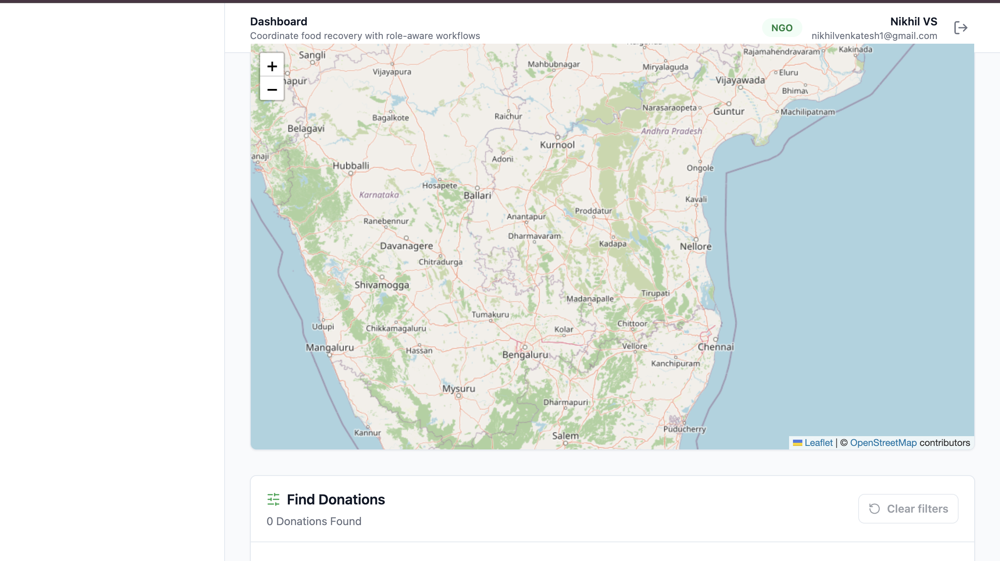

### Delivery Dashboard

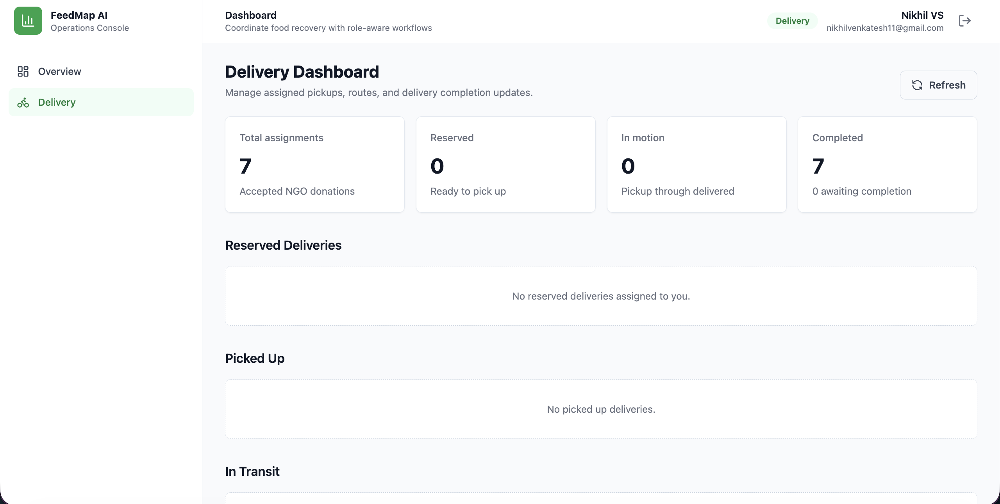
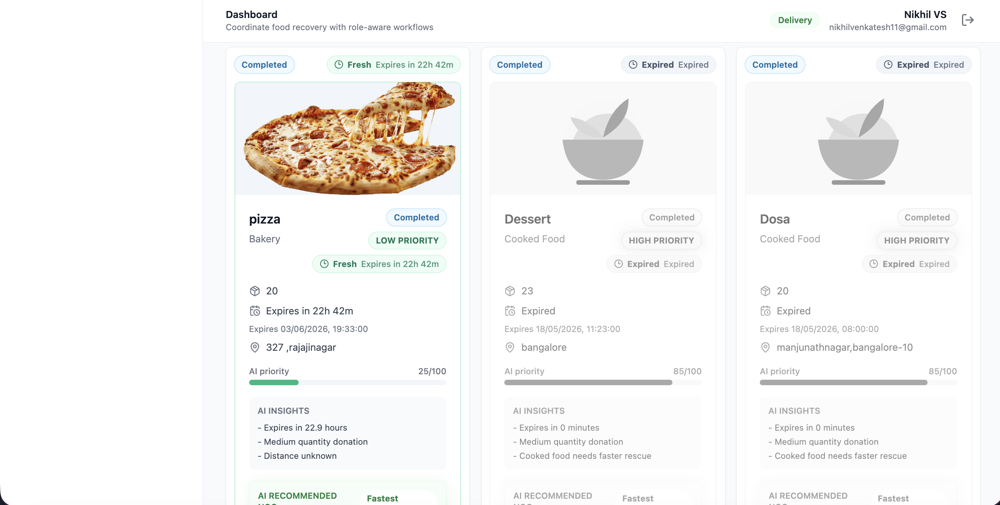

### Admin Dashboard

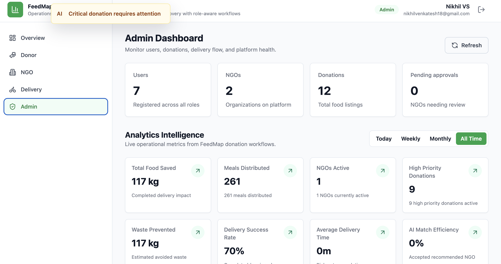
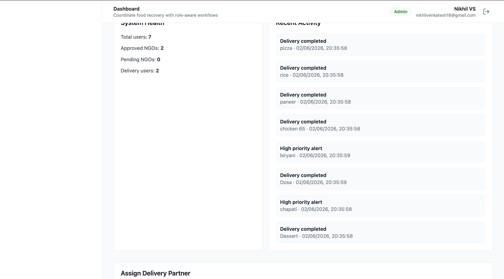
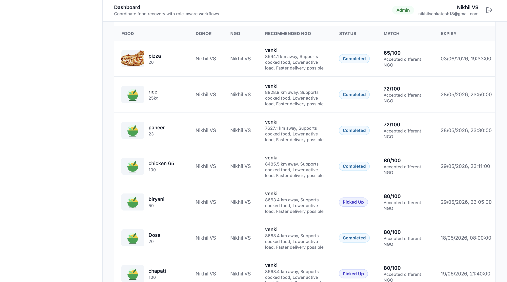

### Analytics Dashboard

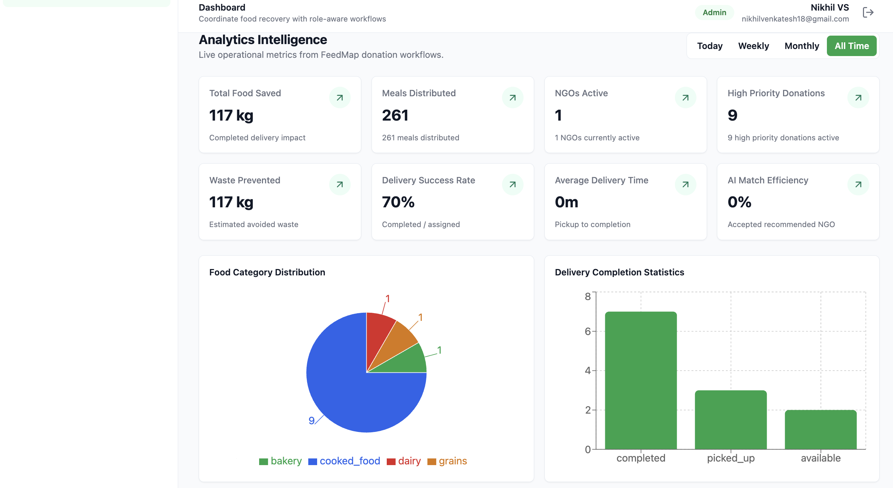
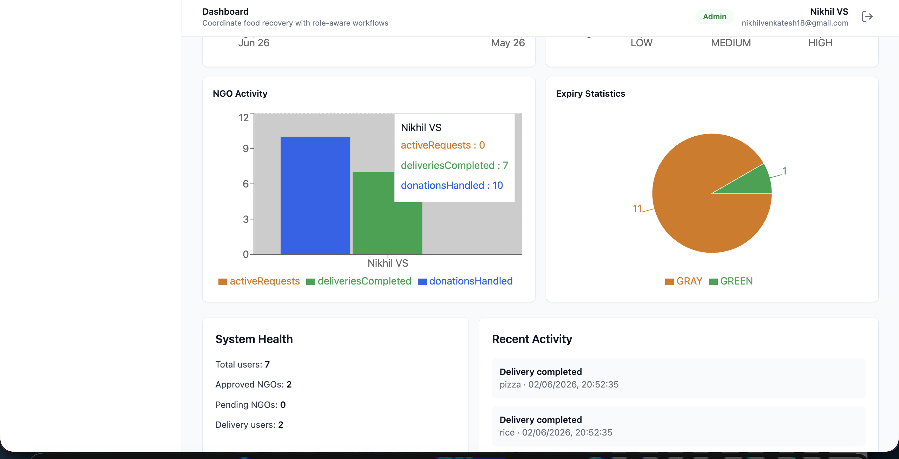